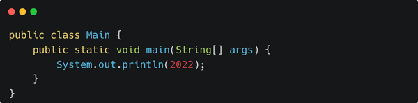
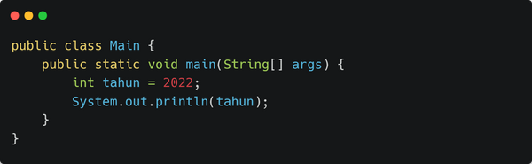
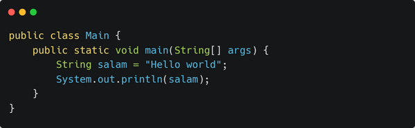

# Kenalan dengan Variabel dan Tipe Data pada Java

Variabel dan Tipe Data termasuk salah satu Fundamental Java yang wajib kita pahami. Karena hampir semua kode program Java tidak lepas dari Variabel dan Tipe Data. Untuk itu kita perlu memahami tentang Variabel dan Tipe Data. Tapi, sebelum itu, ada beberapa istilah yang harus kita ketahui terlebih dahulu.

## Kenalan dengan Istilah Literal/Data

Perhatikan kode program Hello World yang sudah kita bahas pada artikel [Cara Membuat Program Hello World Menggunakan Java](https://kuliahprogramming.id/cara-membuat-program-hello-world-menggunakan-java/) berikut:

Kode **"Hello world"** adalah sebuah Literal atau Data. Tipe dari literal tersebut adalah teks atau String. Kita mudah saja mengetahui ciri-cirinya yaitu menggunakan tanda kutip-ganda (double-quote) di awal dan di akhir literal.

Sekarang kita coba ganti literal **"Hello world"** dengan literal angka **2022**, maka kode program kita akan menjadi seperti berikut:

Coba kita perhatikan! Literal angka **2022** tidak menggunakan tanda kutip-ganda. Inilah yang membedakan literal teks dengan literal angka. Jika **literal teks harus menggunakan tanda kutip-ganda**, sedangkan **literal angka tidak menggunakan tanda kutip-ganda**.

Jadi, literal itu adalah representasi suatu nilai berdasarkan tipenya. Beda tipe, beda juga cara menuliskannya. Literal inilah yang akan disimpan ke dalam variabel.

## Kenalan dengan Variabel

Seperti air di dalam cangkir, literal adalah airnya, sedangkan variabel adalah cangkirnya. Jika literal adalah suatu nilai, berarti variabel adalah tempat untuk menyimpan nilai tadi. Perhatikan kode program berikut:

Kode **tahun** adalah sebuah variabel yang dapat menyimpan literal angka. Angka **2022** disimpan ke dalam variabel bernama **tahun**. Kemudian pada kode berikutnya, variabel **tahun** dijadikan representasi/simbol untuk mendapatkan angka **2022**.

## Apa itu Tipe Data?

Coba perhatikan kode program sebelumnya, pada saat menyimpan angka **2022** ke dalam variabel **tahun**, terdapat kode **int** yang ditulis sebelum nama variabel **tahun**. Kode **int** itu adalah tipe data **Integer** atau tipe data angka.

Coba kita ganti tipe data angka atau **int** menjadi tipe data teks atau **String** seperti sebelumnya, perhatikan kode program berikut.

Ketika kita ganti tipe data int menjadi String, literal angka sebelumnya tidak dapat dimasukkan ke dalam variabel String. Karena literal angka hanya dapat dimasukkan ke variabel angka saja, begitu juga dengan literal teks hanya dapat dimasukkan ke variabel teks saja.

## Apa Saja Tipe Data pada Java

Secara umum, tipe data hanya terdiri dari 2 jenis besar, yaitu: (1) Tipe Data Numerik; dan (2) Tipe Data Nonnumerik. Namun, jika dirincikan dapat dibagi menjadi beberapa tipe data seperti gambar berikut ini:

Tipe data di atas disebut **Tipe Data Primitif**. Sebagian besar dari tipe data primitif adalah numerik atau angka. Ada 3 tipe data berupa numerik, yaitu:

1. Integer, adalah bilangan bulat.
2. Floating point, adalah bilangan berkoma.
3. Character, adalah representasi karakter atau simbol.

Berikut contoh kode program yang menggunakan berbagai tipe data primitif.

Sedangkan untuk tipe data nonnumerik hanya berupa **Boolean**. Yaitu tipe data yang bernilai **True** atau **False**. Tipe data ini banyak digunakan untuk operasi-operasi logika dan perbandingan.

## Membuat Variabel Pada Java

Membuat variabel pada Java sangat *simple* sekali, berikut kita contohkan pada kode program berikut:

Kita dapat perhatikan, untuk membuat sebuah variabel kita harus menentukan tipe data dari variabelnya terlebih dahulu, kemudian diikuti dengan nama variabelnya.

Semua tipe data yang ada pada Java dapat digunakan dalam membuat variabel, misalnya tipe data *int*, *long*, *double*, *boolean*, *char* dan lain sebagainya.

## Memahami Masing-Masing Tipe Data

Untuk memudahkan kita memahami tentang berbagai tipe data di atas, masing-masing tipe data akan kita bahas pada artikel berikut:

> Berikut artikel yang menjelaskan tentang **Tipe Data Integer Pada Java**.

------

## Kesimpulan

Akhirnya kita bisa mengenal berbagai macam tipe data yang ada pada bahasa pemrograman Java. Tentunya mengetahui tipe data saja tidak cukup sampai kita dapat menggunakannya dengan benar pada program yang akan kita buat. Dengan demikian, langkah selanjutnya yang perlu kita pelajari adalah menggunakan tipe data tersebut menggunakan Operator.