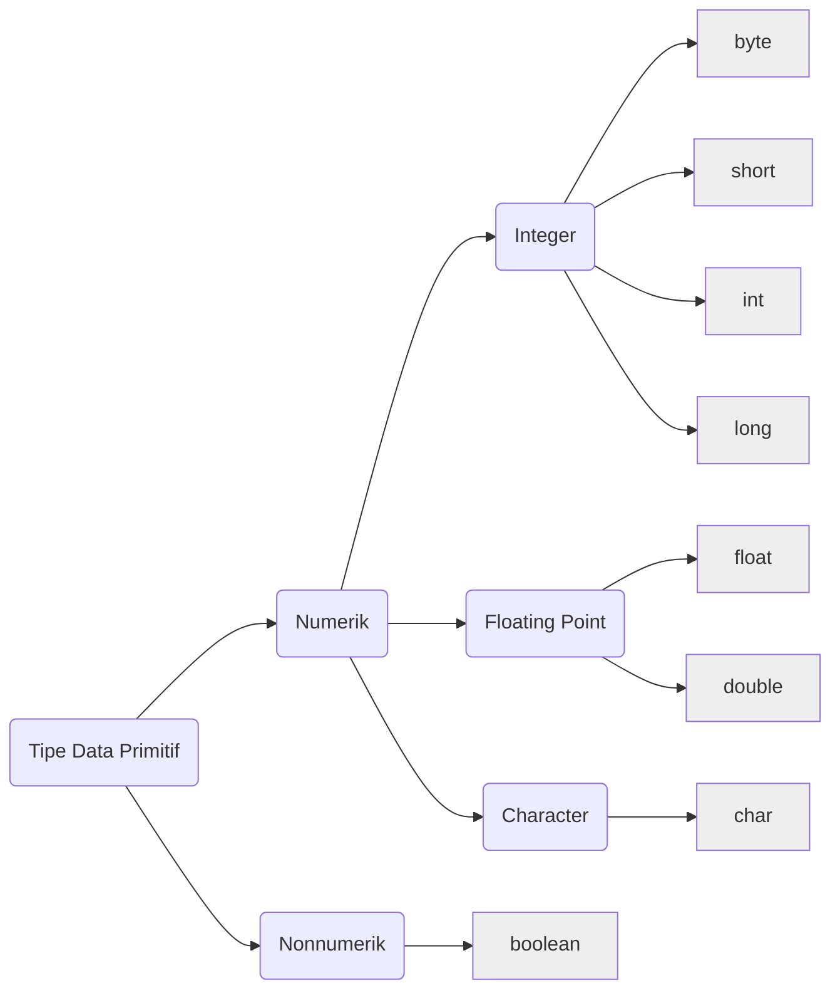
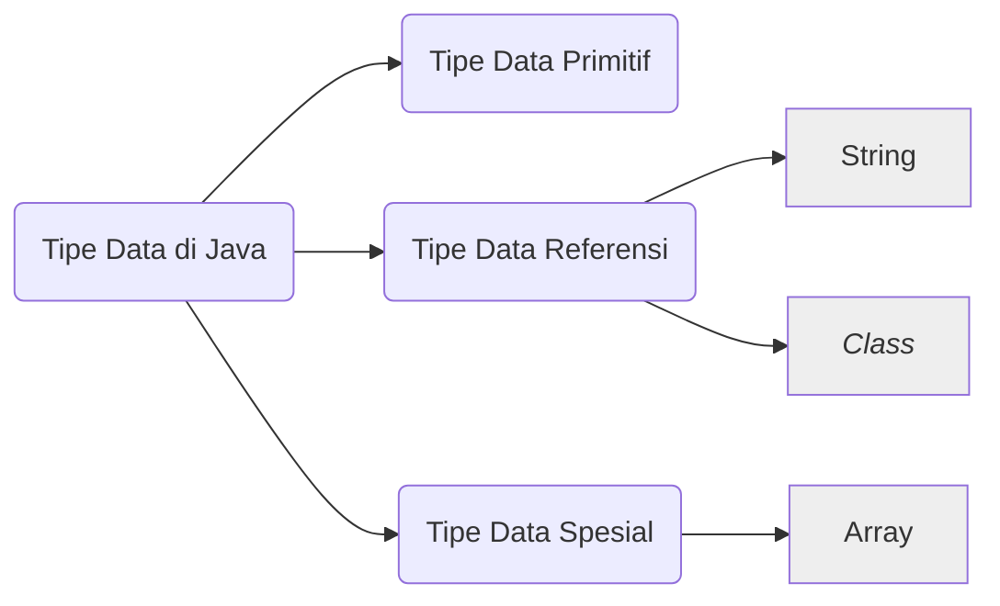

# Kenalan dengan Variabel dan Tipe Data pada Java

- [x] Buat outline materi
- [ ] Periksa link-link
- [x] Periksa typo
- [x] Periksa kalimat
- [x] Semua source code dijadikan teks
- [ ] Buat link ke artikel Tipe Data Referensi
- [ ] Buat link ke artikel Tipe Data Integer
- [ ] Buat link ke artikel Tipe Data Floating Point
- [ ] Buat link ke artikel Tipe Data Character
- [ ] Buat link ke artikel Tipe Data Boolean
- [ ] Buat link ke artikel Operator

Variabel dan Tipe Data termasuk salah satu Fundamental Java yang wajib kita pahami. Karena hampir semua kode program Java tidak lepas dari Variabel dan Tipe Data. Untuk itu kita perlu memahami tentang Variabel dan Tipe Data. Tapi, sebelum itu, ada beberapa istilah yang harus kita ketahui terlebih dahulu.

## Kenalan dengan Istilah Literal/Data

Perhatikan kode program Hello World yang sudah kita bahas pada artikel [Cara Membuat Program Hello World Menggunakan Java](../bab01-memulai-java/05-cara-membuat-program-hello-world-menggunakan-java.md) berikut:

```java
public class HelloWorld {
  public static void main(String[] args) {
    System.out.println("Hello World");
  }
}
```

Kode **"Hello World"** (termasuk tanda kutip ganda) adalah sebuah Literal atau Data. Tipe dari literal tersebut adalah teks atau String. Kita mudah saja mengetahui ciri-cirinya yaitu menggunakan tanda kutip-ganda (*double-quote*) di awal dan di akhir literal.

Sekarang kita coba ganti literal **"Hello world"** dengan literal angka **2022**, kode program kita akan menjadi seperti berikut:

```java
public class HelloWorld {
  public static void main(String[] args) {
    System.out.println(2022);
  }
}
```

Coba kita perhatikan! Literal angka **2022** tidak menggunakan tanda kutip-ganda. Inilah yang membedakan literal teks dengan literal angka. Jika **literal teks harus menggunakan tanda kutip-ganda**, sedangkan **literal angka tidak menggunakan tanda kutip-ganda**.

Jadi, literal itu adalah representasi suatu data atau nilai berdasarkan tipenya. Beda tipe, beda juga cara menuliskannya. Literal inilah yang akan disimpan ke dalam variabel.

## Kenalan dengan Variabel

Seperti air di dalam cangkir, literal adalah airnya, sedangkan variabel adalah cangkirnya. Jika literal adalah suatu nilai, berarti variabel adalah tempat untuk menyimpan nilai tadi. Perhatikan kode program berikut:

```java
public class HelloWorld {
  public static void main(String[] args) {
    int tahun = 2022;
    System.out.println(tahun);
  }
}
```

Kode **tahun** adalah sebuah variabel yang dapat menyimpan literal angka. Angka **2022** disimpan ke dalam variabel bernama **tahun**. Kemudian pada kode berikutnya, variabel **tahun** dijadikan representasi/simbol untuk mendapatkan angka **2022**. Ketika kita menampilkan nilai dari variabel tahun, maka secara otomatis angka **2022** yang ditampilkan.

Ketika nilai dari variabel **tahun** kita ubah menjadi **2023**, maka, tanpa mengubah kode yang lain, hasilnya akan menampilkan angka **2023**.

```java
public class HelloWorld {
  public static void main(String[] args) {
    int tahun = 2023;
    System.out.println(tahun);
  }
}
```

## Apa itu Tipe Data?

Coba perhatikan kode program sebelumnya, pada saat menyimpan angka **2022** ke dalam variabel **tahun**, terdapat kode **int** yang ditulis sebelum nama variabel **tahun**. Kode *int* itu adalah tipe data **Integer** atau tipe data angka.

Coba kita ganti tipe data angka atau *int* menjadi tipe data teks atau String seperti sebelumnya, perhatikan kode program berikut.

```java
public class HelloWorld {
  public static void main(String[] args) {
    String tahun = 2023;
    System.out.println(tahun);
  }
}
```

Ketika kita ganti tipe data *int* menjadi String, literal angka sebelumnya tidak dapat dimasukkan ke dalam variabel String. Karena literal angka hanya dapat dimasukkan ke variabel angka saja, begitu juga dengan literal teks hanya dapat dimasukkan ke variabel teks saja.

## Apa Saja Tipe Data pada Java

Secara umum, tipe data pada Java hanya terdiri dari 2 jenis besar, yaitu: (1) Tipe Data Numerik; dan (2) Tipe Data Nonnumerik. Namun, jika dirincikan dapat dibagi menjadi beberapa tipe data seperti gambar berikut ini:



Tipe data di atas disebut **Tipe Data Primitif**. Sebagian besar dari tipe data primitif adalah numerik atau angka. Dan sebagian kecil adalah tipe data nonnumerik. 

### Tipe data numerik
Ada 3 tipe data berupa numerik, yaitu:

1. Integer, adalah bilangan bulat.
2. Floating point, adalah bilangan berkoma.
3. Character, adalah representasi karakter atau simbol.

Berikut contoh kode program yang menggunakan berbagai tipe data primitif.

```java
public class Main {
  public static void main(String[] args) {
    int bilBulat = 10;
    double bilBerkoma = 14.3;
    char simbol = 66;
    System.out.println(bilBulat);
    System.out.println(bilBerkoma);
    System.out.println(simbol);
  }
}
```

Berikut *output* yang dihasilkan dari kode program di atas.

```shell
10
14.30
B
```

### Tipe data nonnumerik
Sedangkan untuk tipe data nonnumerik hanya berupa Boolean. Yaitu tipe data yang bernilai **True** atau **False**. Tipe data ini banyak digunakan untuk operasi-operasi logika dan perbandingan. Perhatikan contoh kode program berikut.

```java
public class Main {
  public static void main(String[] args) {
    boolean var1 = false;
    boolean var2 = 10 >= 9;
    System.out.println(var1);
    System.out.println(var2);
  }
}
```

## Tipe Data Referensi 

Selain Tipe Data Primitif, ada juga Tipe Data Referensi yang dapat digunakan pada Java. Salah satu Tipe Data Referensi adalah String.



## Membuat Variabel Pada Java

Membuat variabel pada Java sangat *simple* sekali, berikut kita contohkan pada kode program berikut:

```java
public class Main {
  public static void main(String[] args) {
    String nama = "Budi";    // Tipe data String
    int nilai = 12;          // Tipe data Integer
    double rataRata = 7.85;  // Tipe data Floating Point
    boolean setuju = true;   // Tipe data Boolean
  }
}
```

Dapat kita perhatikan, untuk membuat sebuah variabel kita harus menentukan tipe data dari variabelnya terlebih dahulu, kemudian diikuti dengan nama variabelnya. Perhatikan ilustrasi berikut ini.


Semua tipe data yang ada pada Java dapat digunakan dalam membuat variabel, misalnya tipe data *int*, *long*, *double*, *boolean*, *char* dan lain sebagainya.

## Memahami Masing-Masing Tipe Data

Untuk memudahkan kita memahami tentang berbagai tipe data di atas, masing-masing tipe data akan kita bahas pada artikel berikut:
1. Memahami Tipe Data [Integer](02-memahami-tipe-data-integer-pada-java.md)
2. Memahami Tipe Data [Floating Point](03-memahami-tipe-data-floating-point.md)
3. Memahami Tipe Data [Character](04-memahami-tipe-data-character.md)
4. Memahami Tipe Data [Boolean](05-memahami-tipe-data-boolean.md)
5. Memahami Tipe Data [String](06-memahami-tipe-data-string.md)

------

## Kesimpulan

Kita sudah mengenal berbagai tipe data yang ada pada bahasa pemrograman Java. Tentunya mengetahui tipe data saja tidak cukup sampai kita dapat menggunakannya dengan benar pada program yang akan kita buat. Dengan demikian, selanjutnya kita perlu pelajari cara  menggunakan tipe data tersebut menggunakan [Operator](01-kenalan-dengan-operator-operand-dan-expression-pada-java.md).