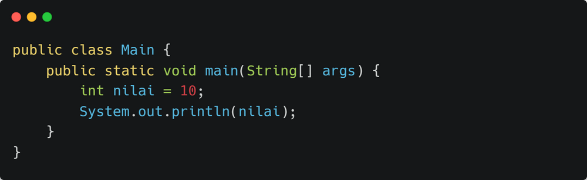
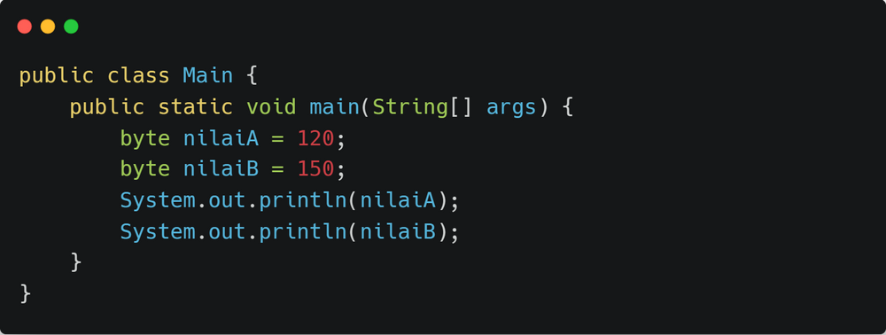
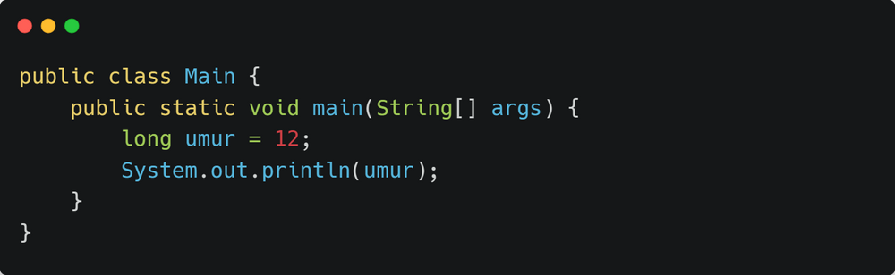
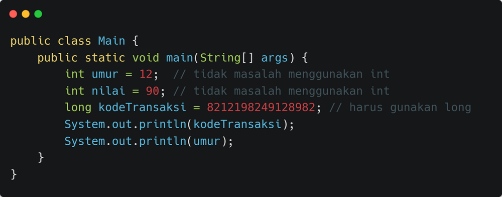

# Mengenal Tipe Data Integer Pada Java

**Tipe Data Integer** adalah tipe data yang digunakan untuk menyimpan **bilangan bulat**. Agar kita mudah memahami, yuk kita coba latihan menggunakan kode program berikut:

> Belum bisa menulis kode program di atas? Cek materi [berikut ini](https://kuliahprogramming.id/cara-membuat-program-hello-world-menggunakan-java/) untuk mempelajari cara menulis kode program dan menjalankannya.

Dari kode program di atas kita sudah punya variabel **nilai** dengan tipe data **int** atau **integer**. Nilai yang dimasukkan adalah **10** yang merupakan bilangan bulat (tidak berkoma). Jika kode program di atas dijalankan, hasilnya jadi seperti berikut:

Jika kita berhasil mengeluarkan output seperti di atas, berarti kita sudah menggunakan tipe data integer. Tapi perjuangan kita belum selesai. Kita perlu mendalami tentang tipe data integer.

## Byte, Short, Int dan Long

Tipe data Integer ada 4 jenis, masing-masing memiliki ukuran data yang berbeda-beda. Efeknya masing-masing tipe data hanya dapat menyimpan angka dengan *range* tertentu. Berikut rinciannya:

| Tipe Data | Ukuran | Range                                       |
| --------- | ------ | ------------------------------------------- |
| byte      | 1 byte | -128 sd 127                                 |
| short     | 2 byte | -32768 sd 32767                             |
| int       | 4 byte | -2147483648 sd 2147483647                   |
| long      | 8 byte | -9223372036854755808 sd 9223372036854755807 |

Artinya, kita tidak bisa menyimpan angka **200** ke dalam variabel tipe data **byte**, atau angka **10 milyar** ke dalam variabel tipe data **int**. Hal ini karena *range* tipe data **byte** maksimal hanya **127** saja, tidak bisa sampai **200** atau **-200**. Begitu juga dengan range **int** dan seterusnya.

> Ingat kembali tipe data pada Java pada [materi sebelumnya](https://kuliahprogramming.id/kenalan-dengan-variabel-dan-tipe-data-pada-java/)!

Supaya kita tidak mudah memahaminya, yuk kita cobain dengan kode program berikut:

Perhatikan baris kode *byte* **nilaiB**, variabel **nilaiB** akan dianggap *error* karena angka 150 tidak dapat dimasukkan ke variabel **nilaiB** yang bertipe *byte*. *Byte* hanya dapat menyimpan angka sampai **128** saja, tidak dapat menyimpan angka sampai **150**.

## Pilih Tipe Data Yang Sesuai

Dengan demikian, kita harus bisa menggunakan masing-masing tipe data tersebut sesuai kebutuhan kita, jangan gunakan tipe data yang besar untuk menyimpan angka yang kecil.

Berikut contoh-contoh kode program yang menggunakan tipe data yang terlalu besar:

Kita dapat memprediksi bahwa hampir tidak mungkin nilai umur akan lebih dari 127 tahun. Sehingga kita cukup menggunakan tipe data *byte* untuk variabel umur. Atau, **jika kita khawatir** seseorang bisa memiliki umur lebih dari 127 tahun, kita bisa naikkan tipe datanya menjadi *short* agar lebih aman. Tidak perlu gunakan *long*.

Tentunya untuk program skala kecil, pengaruh kinerja program terhadap kesalahan dalam memilih tipe data ini tidak akan terasa atau **dampaknya sangat kecil sekali.** Namun, tidak ada salahnya dari awal kita sudah membiasakan dalam menggunakan tipe data yang sesuai dengan kebutuhan.

> TIPS: Hampir di sebagian besar kasus umum, tipe data bilangan bulat yang sering digunakan pada pemrograman Java adalah *int*, kecuali angka yang disimpan melebihi kapasitas dari *int*, maka digunakan *long*.

## Kesimpulan

Sampai disini kita sudah mengenal tentang tipe data Integer pada Java. Tentunya tipe data pada Java bukan hanya Integer saja, ada beberapa lagi tipe data yang ada di Java, salah satunya adalah tipe data Real atau Floating Point.