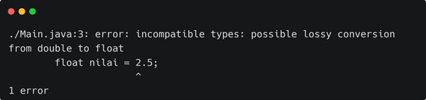

# Memahami Tipe Data Floating Point, Real atau Double pada Java

Istilah *Floating Point*, *Float*, *Real*, *Double* mengacu kepada maksud yang sama, yaitu bilangan berkoma. Di dalam pemrograman Java, penting bagi kita mengetahui tentang tipe data ini, karena tipe data ini dapat menyimpan angka berkoma.

Angka berkoma pada dasarnya adalah bilangan pecahan. Misalnya pecahan ½ sebenarnya adalah angka 0,5 (dibaca: nol koma lima). Berikut kode program untuk menampilkan angka berkoma:

```java
public class Main {
  public static void main(String[] args) {
    double nilai = 87.9;
    System.out.println(nilai);
  }
}
```

Variabel **nilai** berupa tipe data *double*. Dengan demikian variabel tersebut dapat menyimpan angka 87,9 (dibaca: delapan puluh tujuh koma sembilan).

## Literal/Data Bilangan Berkoma

Sebelum menggunakan tipe data *floating point*, kita harus memahai tentang literal bilangan berkoma (*floating point literal*). Literal atau data berarti cara kita menuliskan sebuah nilai di dalam kode program. Bilangan berkoma juga harus ada cara menuliskannya di kode program. Perhatikan contoh kode berikut:

```java
public class Main {
  public static void main(String[] args) {
    double pi = 3.14;
  }
}
```

Angka `3.14` adalah literal angka berkoma. Literal angka berkoma menggunakan tanda titik `.` untuk pemisah nilai desimal. Sehingga angka `3.14` dapat dibaca `tiga koma empat belas`. Sedangkan angka ribuan pada Java tidak ada tanda pemisahnya. Perhatikan contoh kode program berikut:

```java
public class Main {
  public static void main(String[] args) {
    double n1 = 6.25;
    double n2 = 112500.750;
    double n3 = 81;
  }
}
```

Pada kode program di atas, variabel **n3** dapat menyimpan angka berkoma walaupun ditulis tanpa tanda koma.

## Float dan Double

Tipe data *Floating Point* ada dua jenis yaitu *Float* dan *Double*. Tentunya masing-masing memiliki *range* data tersendiri. Berikut spesifikasi masing-masing tipe data *floating point* pada Java.

| Tipe Data | Ukuran | Range                   |
| --------- | ------ | ----------------------- |
| float     | 4 byte | Hingga 7 angka desimal  |
| double    | 8 byte | Hingga 15 angka desimal |

> TIPS: Secara umum Java menggunakan *double* untuk berbagai macam kalkulasi dan kode program. Sehingga penggunaan *float* hampir tidak pernah atau jarang sekali digunakan karena tingkat presisinya 7 angka di belakang koma.

## Beda Literal/Data Float dengan Double

Karena perbedaan antara kedua tipe data ini hanya tingkat presisinya, sehingga angka 2,5 dengan angka 2,50000 memiliki nilai yang sama walaupun jumlah angka di belakang koma tidak sama. Dengan demikian, harus ada cara untuk membedakan literasi 2,5 versi *float* dengan literasi 2,5 versi *double*.

Perhatikan kode program berikut ini:

```java
public class Main {
  public static void main(String[] args) {
    double n1 = 2.5;
    float n2 = 2.5f;
  }
}
```

Kita harus menambahkan huruf **F** atau **f** setelah angka supaya angka tersebut dianggap sebagai tipe data *float*. Jika kita tidak menambahkan huruf **F** atau **f** maka Java akan menganggap angka tersebut sebagai *double*. Untuk membuktikannya kita perhatikan kode program berikut:

```java
public class Main {
  public static void main(String[] args) {
    float nilai = 2.5;
    System.out.println(nilai);
  }
}
```

Jika kode program tersebut dijalankan akan menghasilkan *error* seperti berikut:
```shell
./Main.java:3: error: incompatible types: possible lossy conversion from double to float
        float nilai = 2.5;
                      ^
1 error
```



Pesan *error* tersebut menjelaskan adanya tipe data yang tidak kompatibel. Variabel *float* tidak dapat digunakan untuk menyimpan data *double*. Data *double* yang dimaksud adalah angka 2.5 tanpa disertai dengan huruf **F** atau **f**.

## Kesimpulan

Kita sudah mengenal tipe data Floating Point yang terdiri dari tipe data float dan double. Tipe data ini digunakan untuk menyimpan data angka berkoma atau angka desimal. Sedangkan jika kita ingin menyimpan data bilangan bulat, kita dapat menggunakan tipe data Integer.