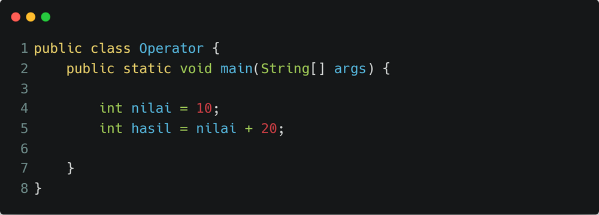
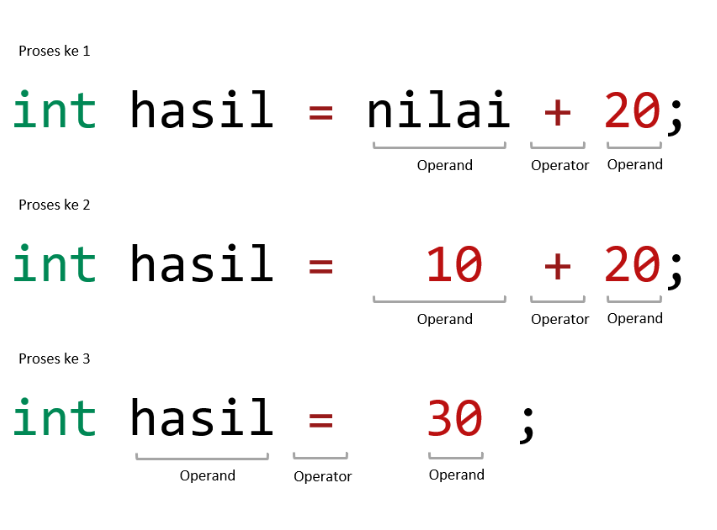

# Kenalan Dengan Operator dan Operand Pada Java
Data dan variabel tidak akan berguna jika tidak dioperasikan. Operasi data dan variabel sangat banyak sekali. Misalkan menambahkan antara variabel pertama dan variabel kedua, dan sebagainya.

Itulah mengapa kita perlu memahami tentang fundamental dari _Operator_ pada Pemrograman Java. Materi kali ini bakal kita bahas tuntas tentang berbagai jenis operator pada Java.
## Operator dan Operand
Ada 2 (dua) istilah yang harus kita pahami pada awal pembahasan ini, yaitu **Operator **dan **Operand**. _Operator_ adalah simbol yang berfungsi untuk menjalankan operasi. Sedangkan _operand_ adalah data atau variabel atau lainnya yang dioperasikan.
### Kenali Yang Mana Operator dan Operand
Supaya kita lebih mudah mengenali _operator_ dan _operand_ yang ada di dalam kode program, perhatikan ilustrasi berikut ini!

Tanda ➕ pada ilustrasi di atas adalah sebuah _operator_. Sedangkan angka 10 dan angka 25 adalah _operand_. Ketika operator dijalankan terhadap _operand_, maka _operator_ tersebut akan menghasilkan sebuah data baru. Pada contoh di atas, angka `10` ditambahkan dengan angka `25` akan menghasilkan angka baru, yaitu angka `35` dengan tipe data `int`.

Selain tanda ➕ juga terdapat banyak simbol lainnya yang berfungsi sebagai _operator_. Mengetahui berbagai macam _operator_ akan memudahkan kita untuk membuat sebuah instruksi pada pemrograman Java. Perhatikan kode program berikut ini!

Pada baris ke 4 kode program di atas, simbol `=` (sama dengan) adalah juga _operator_. Simbol tersebut berfungsi untuk menyimpan data yang ada pada _operand_ sebelah kanan, disimpan ke _operand_ sebelah kiri.

Pada baris ke 5 kode program di atas terdapat 2 (dua) _operator_ yang berbeda, yaitu _operator_ `=` dan _operator _`+`. Kedua _operator_ ini akan dioperasikan berurutan sesuai dengan ketentuan tertentu. Perhatikan ilustrasi berikut!

Apabila terdapat beberapa _operator_ dalam satu instruksi, maka setiap _operator_ akan diproses sesuai dengan ketentuan dan tingkat prioritas dari masing-masing _operator_. Ketentuan ini disebut dengan _precedence_.

Pada contoh ilustrasi di atas, _operator_ yang dijalankan terlebih dahulu adalah _operator_ `+` yaitu menambahkan data pada variabel `nilai` ditambahkan dengan angka `20` sehingga menjadi angka `30`. Selanjutnya baru dijalankan _operator_ `=` untuk menyimpan angka `30` tadi ke dalam variabel `hasil`.

Berbeda _operator_, berbeda pula tingkat prioritasnya. Kita akan bahas materi ini pada artikel **Operator Precedence**.

## Selanjutnya

Sampai disini kita sudah kenal dengan istilah operator dan operand. Selanjutnya kita perlu memahami berbagai macam operator yang ada. Di antaranya melakukan assignment dan perhitungan aritmatika dan lain sebagainya.