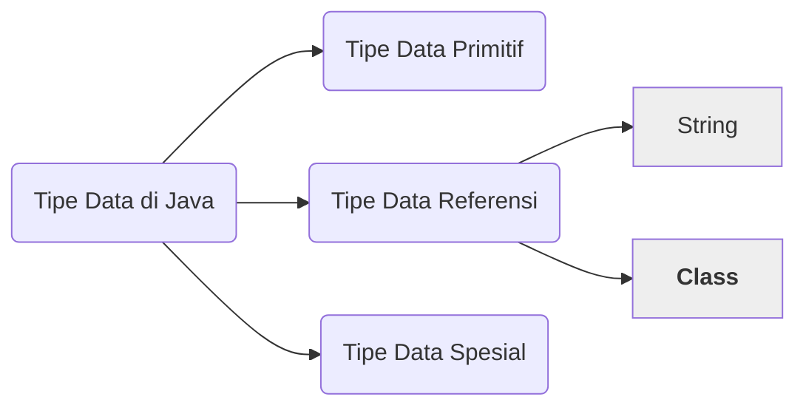
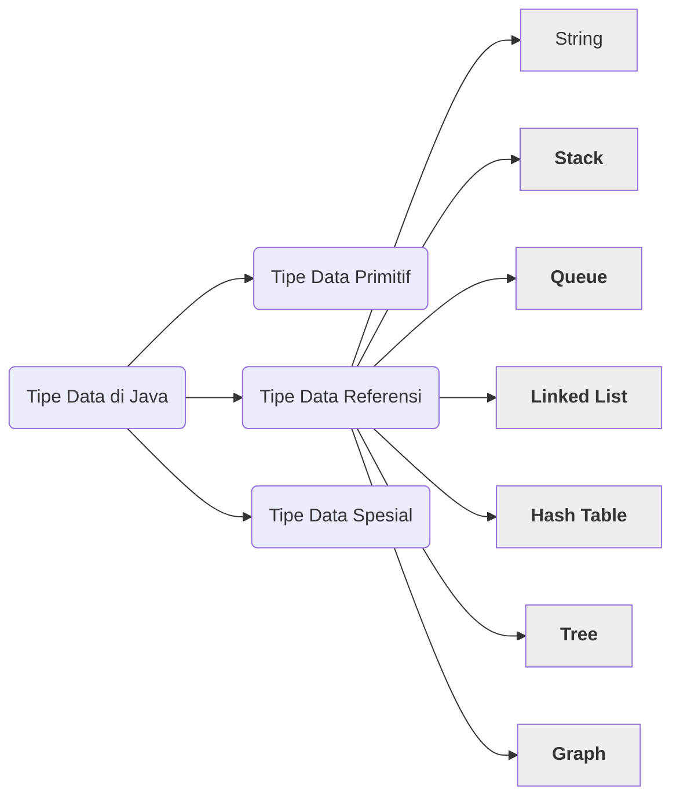

# Tipe Data Pada Java

Masih ingat dengan 3 jenis tipe data pada Java? Ada Tipe Data Primitif, Tipe Data Referensi dan Tipe Data Spesial.

Tipe Data Primitif berisi int, long, double boolean dan sebagainya. Sedangkan Tipe Data Referensi diisi oleh String dan semua Class yang ada di Java. Tentunya setiap Class punya fungsi masing-masing, yang tidak dapat dibahas semua satu persatu. Terakhir adalah Tipe Data Spesial yang diisi oleh Array. Masing-masing dari ketiga tipe data tersebut memiliki ciri khas dan fungsi yang berbeda.

## Tipe Data Abstrak

Pada Java, Tipe Data Abstrak (Abstract Data Type / ADT) adalah Class yang 

> A set of data values and associated operations that are precisely specified independent of any particular implementation. - NIST

