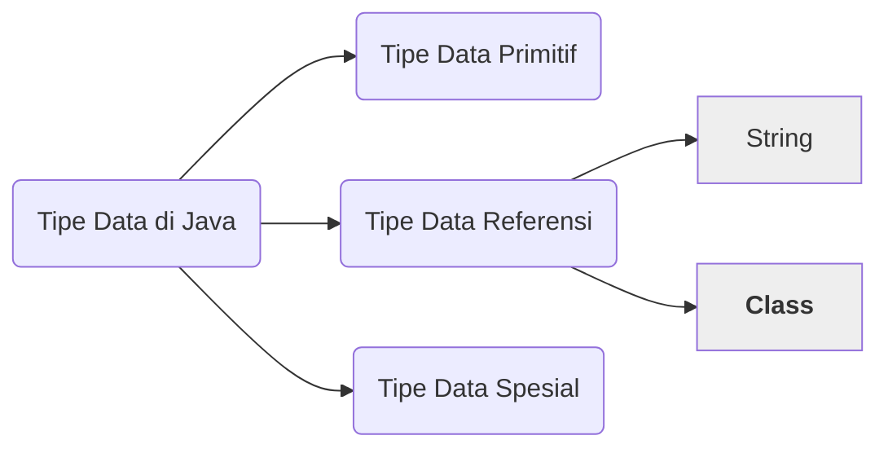
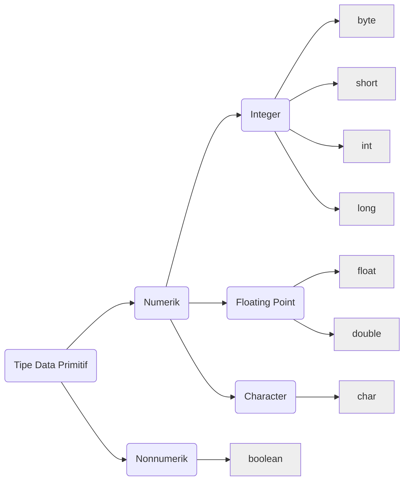

# Sekilas Tentang Tipe Data Pada Java

Tipe Data termasuk salah satu materi Fundamental Java yang wajib kita pahami. Karena hampir semua kode program Java pasti akan menggunakan Tipe Data. Sehingga memahami Tipe Data pada Java adalah sebuah keharusan sebelum kita mempelajari tentang Tipe Data Abstrak dan Struktur Data.

## Apa Saja Tipe Data Pada Java

Secara keseluruhan, Tipe Data pada Java dibagi menjadi: (1) Tipe Data Primitif; (2) Tipe Data Referensi; dan (3) Tipe Data Spesial.

Di berbagai sumber, banyak sekali yang hanya membahas Tipe Data Primitif saja. Ini dikarenakan Tipe Data Primitif adalah Tipe Data yang paling dasar dan paling sederhana pada Java. Meski demikian, Tipe Data Primitif terbagi menjadi 2 jenis, yaitu: (1) Tipe Data Numerik; dan (2) Tipe Data Nonnumerik. Berikut adalah pengelompokkan Tipe Data Primitif pada Java.

## Pelajari Lebih Lanjut

Pelajari lebih lanjut tentang [Tipe Data Primitif pada Java melalui artikel berikut](01-kenalan-dengan-variabel-dan-tipe-data-pada-java.md).

## Selanjutnya

Memahami Tipe Data Primitif pada Java dapat membantu kita dalam memahami Tipe Data lainnya yang lebih kompleks. Sangat disarankan kita memahami materi tersebut sebelum melanjutkan mempelajari tentang [Tipe Data Abstrak pada Java](02-mengenal-tipe-data-abstrak-pada-java.md).