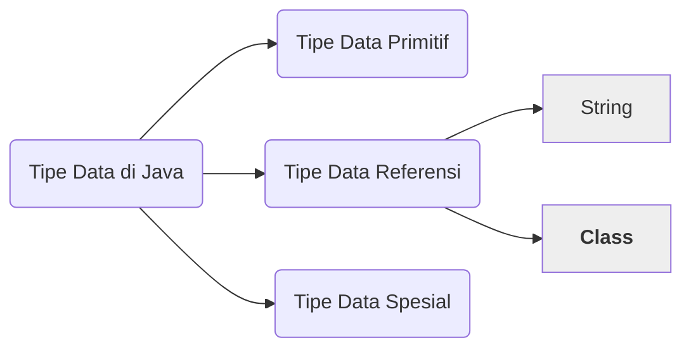
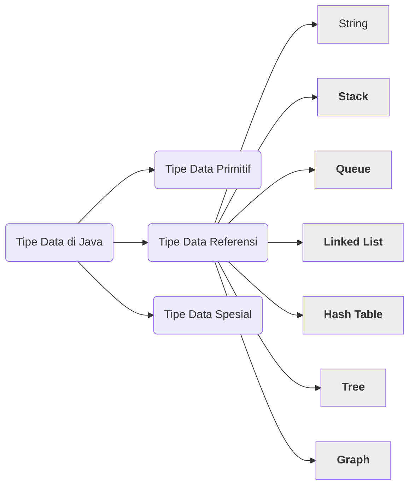

# Mengenal Tipe Data Abstrak Pada Java

Masih ingat dengan 3 jenis tipe data pada Java? Ada Tipe Data Primitif, Tipe Data Referensi dan Tipe Data Spesial.



Tipe Data Primitif berisi int, long, double boolean dan sebagainya. Sedangkan Tipe Data Referensi diisi oleh String dan semua Class yang ada di Java. Tentunya setiap Class punya fungsi masing-masing, yang tidak dapat dibahas semua satu persatu. Terakhir adalah Tipe Data Spesial yang diisi oleh Array. Masing-masing dari ketiga tipe data tersebut memiliki ciri khas dan fungsi yang berbeda. Lalu, dimana Tipe Data Abstrak?

## Tipe Data Abstrak

Pada Java, Tipe Data Abstrak (Abstract Data Type / ADT) adalah Class yang dapat melakukan operasi tertentu terhadap objek-objek dari tipe data lainnya. Sedangkan menurut definisi dari NIST, Tipe Data Abstrak adalah,

> A set of data values and associated operations that are precisely specified independent of any particular implementation. - NIST

Dari beberapa definisi di atas, ada beberapa hal yang dapat kita pahami, antara lain:
1. Tipe Data Abstrak pada Java termasuk Tipe Data Referensi karena merupakan Class.
2. Memiliki field dan method tertentu yang dapat diaplikasikan terhadap berbagai tipe data di Java. Mirip Array, tapi bukan Array.

## Apa saja Tipe Data Abstrak

Ada beberapa jenis Tipe Data Abstrak yang populer digunakan, di antaranya:
1. Stack, tipe data yang menggunakan prinsip tumpukan (stack) dalam menyimpan koleksi data.
2. Queue, tipe data yang menggunakan prinsip antrian (queue) dalam menyimpan koleksi data.
3. Linked List, tipe data yang terkoneksi secara berantai dari satu data ke data lainnya.
4. Hash Table, tipe data yang menyimpan koleksi data menggunakan prinsip hashing.
5. Tree, tipe data yang dapat menyimpan data secara hirarki.
6. Graph, tipe data yang dapat saling terkoneksi satu dengan data lainnya.



Masing-masing Tipe Data Abstrak tersebut akan kita bahas lebih rinci secara terpisah. Untuk saat ini tentunya kita akan fokus dengan memahami tentang Tipe Data Abstrak secara umum dan apa saja Tipe Data Abstrak yang biasa digunakan.

## Menggunakan Tipe Data Abstrak

Kita dapat menggunakan Tipe Data Abstrak seperti menggunakan Class lainnya pada Java, perhatikan contoh kode program berikut:

```java
public class Main {
	public static void main(String[] args) {
		Stack obj = new Stack(5);
		obj.push(8);
		obj.push(12);
		obj.push(5);
		System.out.println(obj.pop());
		System.out.println(obj.pop());
		System.out.println(obj.pop());
	}
}
```

Tentu saja untuk menjalankan kode program di atas, kita harus membuat class `Stack` terlebih dahulu. Karena Java tidak menyediakan hampir sebagian besar Tipe Data Abstrak yang kita pelajari. Dan, memang umumnya Tipe Data Abstrak dapat dibuat pada Java ataupun berbagai bahasa pemrograman lainnya. Itulah sebabnya kita akan membahas masing-masing Tipe Data Abstrak di atas pada bab yang berbeda.

## Kesimpulan

Semua Tipe Data Abstrak yang akan dipelajari merupakan Tipe Data yang kompleks dan berstruktur. Untuk memahami konsep ini, silahkan pelajari tentang [Struktur Data dan Manfaatnya](03-struktur-data-dan-manfaatnya.md).

## Selanjutnya

Sebelum kita lebih jauh memahami tentang masing-masing Tipe Data Abstrak di atas, ada satu materi lagi yang harus kita pahami, yaitu [Rekursif](01-mengenal-rekursif-pada-java.md).